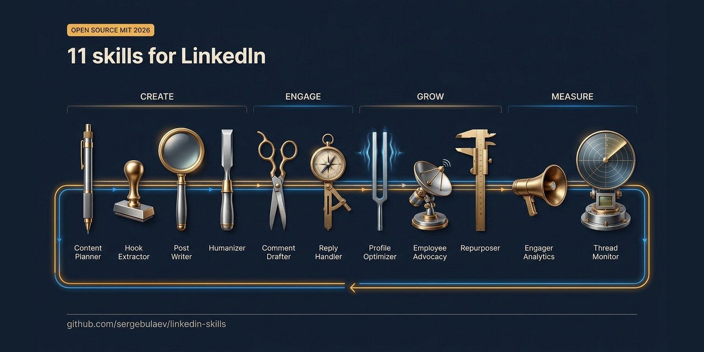

<p align="center">
  
</p>

# Skills de Marketing para LinkedIn para Claude Code e Codex

<p align="center">
  
  
  
  
  
  
  
</p>

**Skills do Claude para LinkedIn.** 11 skills para Claude Code e Codex que escrevem posts, comentários e respostas do LinkedIn na sua voz. Elas redigem o conteúdo, removem marcas de IA e aguardam sua aprovação antes de qualquer publicação. Não é preciso programar.

> **Também está em outra plataforma?** A mesma equipe distribui pacotes de skills de marketing equivalentes para [X (Twitter)](https://github.com/sergebulaev/x-skills) · [Instagram](https://github.com/sergebulaev/instagram-skills) · [YouTube](https://github.com/sergebulaev/youtube-skills) · [TikTok](https://github.com/sergebulaev/tiktok-skills) · [Threads](https://github.com/sergebulaev/threads-skills) · [Facebook](https://github.com/sergebulaev/facebook-skills). Mesmo motor de voz, mesmo fluxo de aprovar-antes-de-publicar.

## Instalação

Escolha a forma como você usa Claude Code ou Codex:

### Codex CLI

```bash
codex plugin marketplace add sergebulaev/linkedin-skills
codex plugin add linkedin-skills@linkedin-skills
```

Para testar um clone local antes de publicar mudanças:

```bash
git clone https://github.com/sergebulaev/linkedin-skills.git
cd linkedin-skills
codex plugin marketplace add .
codex plugin add linkedin-skills@linkedin-skills
```

### claude.ai (web)

1. Abra https://claude.ai/code
2. Vá em **Skills** na barra lateral
3. Clique em **Add from GitHub**
4. Cole: `sergebulaev/linkedin-skills`
5. Pronto. As skills são ativadas automaticamente quando você perguntar sobre LinkedIn.

### Claude Desktop (Mac / Windows)

1. Abra o Claude Desktop
2. Clique em **Customize**
3. Clique no **+** ao lado de **Personal plugins** → **Create plugin** → **Add marketplace**
4. Escolha **Add from a repository** e cole: `sergebulaev/linkedin-skills`
5. Instale o plugin
6. Pronto. Inicie uma nova conversa e peça ao Claude para escrever um post no LinkedIn.

### OpenClaw

1. Abra seu diretório de trabalho do OpenClaw
2. Clone as skills nele:
   ```bash
   git clone https://github.com/sergebulaev/linkedin-skills.git
   ```
3. Nas configurações do OpenClaw, adicione isto ao seu system prompt:
   ```
   You have LinkedIn marketing skills in ./linkedin-skills/.
   For any LinkedIn task, read the relevant skills/*/SKILL.md first.
   Use lib/url_parser.py for URL parsing,
       lib/apify_client.py for reading posts / comments / engagers,
       lib/publora_client.py for publishing actions.
   ```
4. Pronto. Peça ao OpenClaw para escrever um post ou comentário no LinkedIn.

### Claude Code (CLI / VS Code / JetBrains)

```
/plugin marketplace add sergebulaev/linkedin-skills
/plugin install linkedin-skills@linkedin-skills
```

Ou clone o repositório e abra-o como seu diretório de trabalho:

```bash
git clone https://github.com/sergebulaev/linkedin-skills.git
cd linkedin-skills
```

### Hermes Agent

O Hermes Agent (Nous Research) segue o padrão aberto agentskills.io e carrega `skills/*/SKILL.md` diretamente. Clone o pacote na sua pasta de skills do Hermes:

```bash
git clone https://github.com/sergebulaev/linkedin-skills.git ~/.hermes/skills/linkedin-skills
```

Vindo do OpenClaw? `hermes claw migrate` importa essas skills automaticamente. Depois chame `/<skill-name>` a partir de qualquer uma das suas interfaces de chat do Hermes.

### Qualquer agente (CLI de skills)

Um único comando que funciona em Claude Code, Codex, Cursor e qualquer outro agente que leia arquivos SKILL.md:

```bash
npx skills add sergebulaev/linkedin-skills
```

> **Achou útil? [Dê uma estrela no repositório](https://github.com/sergebulaev/linkedin-skills).** Os diretórios de Claude Code e Codex mais bem curados ranqueiam e filtram por número de estrelas, então uma estrela é o que torna essas skills encontráveis para a próxima pessoa. É a única coisa que pedimos. Sem cadastro, sem e-mail.

## O que você pode fazer

Depois de instalado, basta pedir ajuda ao Claude Code ou ao Codex sobre LinkedIn. A skill certa é ativada automaticamente.

**Escrever um post:**
> "Escreva um post no LinkedIn sobre por que agências de IA estão substituindo as tradicionais. Deixe viral."

**Comentar no post de alguém:**
> "Comente neste post: https://linkedin.com/posts/... — quero adicionar uma reflexão pertinente."

**Revisar um rascunho antes de publicar:**
> "Audite este rascunho de post em busca de marcas de IA e problemas de algoritmo: [cole seu texto]"

**Fazer engenharia reversa de um post viral:**
> "Que fórmula de gancho este post usa? https://linkedin.com/posts/..."

**Planejar sua semana:**
> "Crie um plano de conteúdo de 7 dias para o LinkedIn. Sou fundador de uma SaaS B2B mirando VPs de Marketing."

**Reescrever seu perfil:**
> "Otimize meu perfil do LinkedIn para leads inbound: https://linkedin.com/in/seunome"

**Remover marcas de IA de qualquer texto:**
> "Humanize este texto: [cole o rascunho gerado por IA]"

Toda skill mostra um rascunho primeiro e aguarda seu aval antes de fazer qualquer coisa. Nada é publicado sem sua aprovação.

## As 11 skills

| Skill | O que faz |
|---|---|
| **Post Writer** | Redige posts prontos para viralizar usando 20 fórmulas de gancho comprovadas de 2026 (anáfora, obituário R.I.P., virada ano a ano, lacuna de curiosidade, abertura emocional a frio, A/B controlado, falso binário e mais 13) além de uma biblioteca de ângulos para a edição de fundadores, escolhida conforme o objetivo de engajamento |
| **Comment Drafter** | Redige um comentário para qualquer post do LinkedIn a partir da sua URL |
| **Reply Handler** | Redige uma resposta a qualquer comentário, tratando corretamente o achatamento de threads em 2 níveis do LinkedIn |
| **Post Audit** | Verifica seu rascunho contra as regras de algoritmo de 2026 e padrões de detecção de IA antes de você publicar |
| **Humanizer** | Remove as marcas de IA às quais leitores humanos e o filtro de "slop" do LinkedIn reagem: vocabulário de IA de 2026 pontuado por densidade em cada parágrafo, pontes de revelação, blocos de frases curtas em staccato, tríades empilhadas, sinceridade forçada; limita travessões em vez de proibi-los. Não promete enganar detectores (nenhuma edição faz isso de forma confiável). Reúne três sub-ferramentas: pontuador de densidade de emojis de IA, testador de dispersão entre múltiplos detectores (GPTZero, Originality.ai, ZeroGPT, Sapling, Copyleaks) que documenta o quanto eles discordam, e uma referência explicativa das regras para justificar escolhas estilísticas. |
| **Hook Extractor** | Faz engenharia reversa da fórmula de gancho de qualquer post viral. Retorna um modelo em branco que você pode preencher com seu próprio tema |
| **Content Planner** | Cria um plano de 7 dias com temas diários de post, formatos, ganchos, horários de publicação e alvos para comentar |
| **Engagement Monitor** | Dois fluxos de leitura: (1) acompanha suas threads de comentário em busca de respostas do autor e redige follow-ups na janela de 6 a 24h; (2) coleta curtidas e comentários em qualquer post e os agrupa por adequação ao ICP (par / aspiracional / prospect). |
| **Profile Optimizer** | Reescreve seu headline, seção Sobre, seção Destaques e Experiência conforme os padrões de conversão de 2026 |
| **Employee Advocacy** | Planeja um programa de LinkedIn para a equipe: lançamento de 14 dias, cadência de publicação, governança de marca, acompanhamento de ROI |
| **Repurposer** | Transforma conteúdo de outra plataforma (tweet, thread, vídeo do YouTube, blog, newsletter) em um post nativo do LinkedIn: refaz o gancho para a dobra da tela, expande até o intervalo ideal de 900-1300 caracteres, move links para o primeiro comentário, executa o humanizer |

## Feito para fundadores

Se você é fundador, o pacote inclui uma camada dedicada para fundadores. Sua verdadeira restrição raramente é alcance. É um número pequeno de leitores de alto impacto: o próximo investidor, a próxima contratação, o parceiro de design que vira case de sucesso. A camada de fundadores otimiza para confiança com esse público restrito, em vez de impressões.

- **10 ângulos para fundadores** (`references/founder-topics.md`) como modelos para preencher: reprecificar a categoria, conteúdo para pipeline, audiência de um, a matemática das chances escassas, a aposta pouco glamorosa, o limite da delegação, serendipidade planejada, o teste da frase evasiva, a linha da delegação, o portão do aprendizado. Cada um se conecta a um objetivo de engajamento e a uma fórmula de gancho.
- **4 fórmulas de gancho estruturais (F17-F20)** que moldam a lógica de um post: anedota A/B controlada, dissolução do falso binário, ponte anedota-encontra-evidência, fechamento de curvas divergentes.
- **Um plano de conteúdo na edição de fundadores** (Convicção / Construindo em público / A matemática / Prova) no Content Planner.

Basta dizer ao Post Writer que você é fundador, ou pedir ao Content Planner um "plano de fundador", que as skills recorrem primeiro a esses recursos.

## Skills da comunidade

Skills independentes construídas por outras pessoas seguindo as convenções deste pacote (as mesmas regras de voz, o mesmo fluxo de cartão de aprovação, a mesma desambiguação `Not for X (use Y)`). Elas vivem nos repositórios de seus autores, então o núcleo permanece com 11 skills e um único pipeline de leitura/escrita. Instale-as ao lado deste pacote da mesma forma.

- [linkedin-outreach](https://github.com/smfardeen7/linkedin-skills/tree/add-linkedin-outreach-skill/skills/linkedin-outreach) por [@smfardeen7](https://github.com/smfardeen7) - redige notas de pedido de conexão com 300 caracteres (10 modelos de cenário) e sequências de follow-up pós-aceite com prazos em dias e regras de parada. Apenas rascunho: o LinkedIn não tem API de convite ou DM, você cola e envia.

Construiu uma? Abra um PR adicionando uma única linha aqui.

## Opcional: ler dados do LinkedIn com o Apify

Quatro das skills (Comment Drafter, Reply Handler, Hook Extractor, Engagement Monitor) conseguem ler o corpo de posts, threads de comentários, seus próprios comentários recentes e as pessoas que curtiram ou comentaram em qualquer post. Sem um token do Apify, elas recorrem a pedir que você cole o texto relevante. Com um token, elas buscam automaticamente.

O plano gratuito do [Apify](https://console.apify.com/sign-up) vem com $5/mês de crédito, o que rende bastante a $1-$5 por 1.000 resultados. As skills usam quatro atores sem cookies:

| Caso de uso | Ator | Custo |
|---|---|---|
| Corpo do post por URL | `supreme_coder/linkedin-post` | $1 / 1.000 |
| Comentários + respostas em um post | `apimaestro/linkedin-post-comments-replies-engagements-scraper-no-cookies` | $5 / 1.000 |
| Seus próprios comentários recentes | `apimaestro/linkedin-profile-comments` | $5 / 1.000 |
| Curtidas + comentários em qualquer post | `scraping_solutions/linkedin-posts-engagers-likers-and-commenters-no-cookies` | $5 / 1.000 |

Configuração: coloque `APIFY_TOKEN=apify_api_...` no seu `.env`. O cliente leve em `lib/apify_client.py` expõe `fetch_post`, `fetch_post_comments`, `fetch_user_recent_comments` e `fetch_post_engagers`.

Um criador de conteúdo típico rodando operações diárias de comentários mais uma varredura semanal de analytics de engajamento fica abaixo de $2/mês, bem dentro do plano gratuito.

## Opcional: publicação automática com o Publora

Por padrão, as skills redigem conteúdo para você copiar e colar no LinkedIn. Se você quiser que o Claude Code ou o Codex publiquem diretamente no seu LinkedIn (e, opcionalmente, no X, Threads, Instagram), conecte o Publora. Leva cerca de 2 minutos.

### O que é o Publora?

O [Publora](https://publora.com) é uma API de publicação que lida com as peculiaridades do LinkedIn (3 formatos diferentes de URL, incompatibilidades no tipo de reação, bugs de achatamento de threads). O plano gratuito dá 15 posts/mês.

O Publora também distribui [skills MCP oficiais](https://github.com/publora/skills) (`npx skills add publora/skills`): uma skill por plataforma, cobrindo apenas o lado da publicação. Este pacote é a camada acima delas, adicionando a leitura, o ofício da escrita e o fluxo de aprovação.

### Configuração (2 minutos)

**Passo 1.** Cadastre-se em https://app.publora.com/signup (grátis)

**Passo 2.** Conecte o LinkedIn: clique em **Channels** na barra lateral esquerda, depois em **Add Channel**, escolha **LinkedIn**, autorize.

**Passo 3.** Encontre seu Platform ID: vá em **Channels**, clique na sua conta do LinkedIn. O ID se parece com `linkedin-ABC123DEF`. Copie tudo, incluindo `linkedin-`.

**Passo 4.** Obtenha sua chave de API: clique em **Settings** (ícone de engrenagem, canto inferior esquerdo), depois em **API**, depois em **Create Key**. Copie a string `sk_...`.

**Passo 5.** Crie um arquivo chamado `.env` na pasta linkedin-skills:

```
PUBLORA_API_KEY=sk_paste_your_key_here
LINKEDIN_PLATFORM_ID=linkedin-paste_your_id_here
```

Se você clonou o repositório, pode copiar o modelo em vez disso:

```bash
cp .env.example .env
```

Depois abra `.env` e substitua os placeholders pelos seus valores reais.

**Passo 6.** Instale dois pequenos pacotes Python:

```bash
pip install requests python-dotenv
```

**Passo 7.** Teste. Peça ao Claude Code ou ao Codex:

> "Agende um post de teste no LinkedIn via Publora para daqui a 24 horas: 'testando a conexão da API — vou cancelar no painel'."

Se o Publora retornar um ID de post agendado, está tudo certo. Cancele o post no painel do Publora antes do horário agendado. Se você receber HTTP 401, sua chave de API está errada. Se receber HTTP 400 sobre um platformId ausente, seu `LINKEDIN_PLATFORM_ID` não está configurado. Veja [Solução de problemas](#solução-de-problemas).

## Opcional: gerar ilustrações com o Pixfaro

Posts com um elemento visual conseguem mais tempo de permanência. O Post Writer pode gerar uma ilustração para um rascunho (uma imagem de feed, um slide de carrossel ou um card de citação com seu gancho) e anexá-la automaticamente ao publicar. Sem uma chave, ele redige o prompt da imagem e pede que você mesmo a gere, então nada quebra.

O [Pixfaro](https://pixfaro.com) é uma única API de imagem sobre múltiplos modelos (do `flux-schnell` a $0,004 até o `gpt-5-image`). Ele sobrepõe seu handle, cor de marca ou logo na imagem como uma **camada pixel a pixel**, então mesmo um modelo base barato renderiza texto nítido em um card de citação ou miniatura. Puxe esses campos de marca do seu [Perfil de Voz e Marca](references/voice-profile.md) (seção 6) e todo ativo permanece alinhado com sua marca.

Configuração: coloque `PIXFARO_TOKEN=pf_live_...` no seu `.env`. O cliente leve em `lib/pixfaro_client.py` e os wrappers `lib.illustrate(prompt, kind=...)` / `lib.refine(image_id, instruction)` retornam uma URL hospedada que vai direto para `lib.publish(..., media_urls=[url])`. O `refine` edita uma imagem anterior pelo seu id (mais barato do que regenerar); os resultados trazem `cost`, `balance_after` e um sinalizador `premium`, para que as skills nunca gastem discretamente em um modelo caro.

## Regras de voz

Toda skill segue estas regras automaticamente:

1. Travessões limitados a cerca de 1 a cada 100 palavras. O caractere deixou de ser uma marca em 2026; a densidade é que é.
2. Capitalize nomes. Sempre. Minúsculas soam como desrespeito.
3. Sem vocabulário de IA: "leverage", "fundamentally", "streamline", "harness", "delve", "unlock", "foster".
4. Números específicos vencem adjetivos. "$14.200" vence "economia significativa".
5. Uma percepção afiada por comentário vale mais que três vagas.
6. 200-350 caracteres para comentários, 900-1.300 caracteres para posts.

## Solução de problemas

| Problema | Correção |
|---|---|
| As skills não ativam quando pergunto sobre LinkedIn | Confirme que você instalou pelo painel de Skills, `/plugin install`, ou `codex plugin add`. Tente iniciar uma nova conversa. |
| "Publora API key not provided" | Seu arquivo `.env` está ausente ou na pasta errada. Ele deve estar na raiz de `linkedin-skills/`. |
| "401 Unauthorized" do Publora | Sua chave de API expirou. Vá em Publora Settings > API > Create a new key. |
| "404 on comment/post" | Seu `LINKEDIN_PLATFORM_ID` está errado. Vá em Publora Channels e copie a string completa `linkedin-...`. |
| Erro "400 reactionType" | Peculiaridade conhecida do Publora. As skills tratam isso automaticamente. Se você estiver chamando a API manualmente, use PRAISE (não CELEBRATE), INTEREST (não INSIGHTFUL). |
| `pip install` falha | Use um ambiente virtual: `python -m venv venv && source venv/bin/activate && pip install requests python-dotenv` |

## Referências transversais

- [`references/industry-benchmarks.md`](references/industry-benchmarks.md) — taxas de engajamento, tempo por post, multiplicadores de alcance entre setores
- [`references/engagement-metrics-taxonomy.md`](references/engagement-metrics-taxonomy.md) — o que medir em nível de post / conta / equipe / negócio

---

<details>
<summary><b>Para desenvolvedores: compatibilidade de runtime, parsing de URL e internos</b></summary>

## Compatibilidade de runtime

```
linkedin-skills/
├── skills/          ← SKILL.md frontmatter; nativo do Claude Code e Codex, outros leem como markdown
├── .codex-marketplace/ ← pacote Codex aninhado gerado (execute scripts/sync_codex_marketplace.py)
├── lib/             ← Python puro, funciona em qualquer runtime de agente
├── references/      ← markdown puro, funciona em qualquer lugar
└── scripts/         ← CLI Python puro, funciona em qualquer lugar
```

| Runtime | Descobre skills automaticamente? | Configuração |
|---|---|---|
| **Claude Code** (CLI, Desktop, Web, IDE) | Sim | Instale via plugin ou clone. As skills ativam com prompts compatíveis. |
| **Codex CLI** | Sim | Instale via `codex plugin marketplace add sergebulaev/linkedin-skills` e `codex plugin add linkedin-skills@linkedin-skills`. |
| **Anthropic Managed Agents** (`/v1/agents`) | Sim | Passe os arquivos de skill no contexto do agente. |
| **OpenClaw** | Manual | Monte o repositório, adicione um system prompt apontando para `skills/*/SKILL.md`. |
| **Cursor / Cline / Aider** | Manual | Leia os arquivos `SKILL.md` como contexto de prompt; importe `lib/` como Python. |
| **Manus** | Não | Faça upload de `references/` como base de conhecimento. Chame a API do Publora diretamente. |
| **LangChain / AutoGen** | Não | Use `lib/` como pacote; alimente `references/` como contexto de prompt. |

### Início rápido no OpenClaw

```bash
git clone git@github.com:sergebulaev/linkedin-skills.git

# Add to OpenClaw system prompt:
# "You have LinkedIn marketing skills in ./linkedin-skills/.
#  Read the relevant skills/*/SKILL.md before any LinkedIn task.
#  Use lib/url_parser.py for URL parsing,
#      lib/apify_client.py for reading posts / comments / engagers,
#      lib/publora_client.py for publishing."
```

### Início rápido para um agente Python genérico

```python
import sys; sys.path.insert(0, "path/to/linkedin-skills")
from lib import parse_linkedin_url, PubloraClient, ApifyClient

parsed = parse_linkedin_url("https://www.linkedin.com/posts/slug-activity-7448808898326654978-iW20")
print(parsed["post_urn"])  # urn:li:activity:7448808898326654978

# Read side (Apify)
apify = ApifyClient()  # reads APIFY_TOKEN from env
post = apify.fetch_post(post_url="https://www.linkedin.com/posts/...")
engagers = apify.fetch_post_engagers(post_url="https://www.linkedin.com/posts/...", max_items=50)

# Write side (Publora)
client = PubloraClient()  # reads PUBLORA_API_KEY from env
client.create_comment(post_urn=parsed["post_urn"], message="draft", platform_id="linkedin-xxx")

# Image side (Pixfaro) — optional, reads PIXFARO_TOKEN from env
from lib import illustrate
img = illustrate("Minimal flat-vector lighthouse, calm blue palette", kind="wide")
# img["url"] -> pass to publish(..., media_urls=[img["url"]])
```

## Tratamento de URL

O LinkedIn tem três tipos de URN de post. O `lib/url_parser.py` trata todos eles:

| Fragmento de URL | URN |
|---|---|
| `/posts/slug-activity-7448...` | `urn:li:activity:7448...` |
| `/posts/slug-share-7449...` | `urn:li:share:7449...` |
| `/feed/update/urn:li:ugcPost:7447...` | `urn:li:ugcPost:7447...` |

URLs de comentário incluem um parâmetro de consulta `commentUrn`. O parser extrai tanto `post_urn` quanto `comment_id`.

## Achatamento de threads

O LinkedIn achata threads de resposta em 2 níveis. Ao responder a uma resposta, `parentComment` deve apontar para o URN do comentário de nível superior, não para o URN da resposta. A skill `linkedin-reply-handler` trata isso corretamente.

## Testando o parser

```bash
python lib/url_parser.py "https://www.linkedin.com/posts/<author-handle>_activity-<id>"
```

</details>

## Referências

- [Documentação da API do Publora](https://docs.publora.com) — referência de endpoints da camada de publicação
- [Console do Apify](https://console.apify.com) — gerencie atores, tokens e uso da camada de leitura
- [Artigo do 360Brew](https://arxiv.org/abs/2501.16450) — o modelo de fundação de ranqueamento do LinkedIn
- [Dados de alcance de 2026 da AuthoredUp](https://authoredup.com/) — benchmarks de alcance por formato

## Quem constrói isto

Essas skills vêm da [Creative Content Crafts](https://cccrafts.ai), uma empresa de engenharia. Nós construímos a maquinaria por trás da voz pública de uma empresa: parsing de ICP, sistemas de engajamento, guardrails de conteúdo e infraestrutura de publicação. Não vendemos as palavras em si.

Chamamos essa camada de **engenharia de conteúdo**. Escrever caiu para o preço de uma assinatura de chat. O que permaneceu valioso é tudo o que está abaixo disso: coletar todo post que seu mercado escreveu nesta semana, manter uma lista viva das pessoas que importam, engajar nela diariamente com julgamento no processo, e capturar os rascunhos arriscados antes que a plataforma o faça.

No LinkedIn especificamente, isso é o trabalho inteiro. Somos engenheiros de crescimento no LinkedIn, não uma agência de ghostwriting.

Este repositório é a camada superior fina dessa pilha, disponibilizada como código aberto. O motor por baixo é o que construímos para clientes.

## Licença

MIT. Powered by [Publora](https://publora.com).

## Pacotes de skills de código aberto relacionados

Parte de uma família de pacotes de skills de marketing de mídia social com IA para Claude Code e Codex:

- **linkedin-skills - LinkedIn (este repositório)**
- [x-skills](https://github.com/sergebulaev/x-skills) - X (Twitter)
- [instagram-skills](https://github.com/sergebulaev/instagram-skills) - Instagram
- [youtube-skills](https://github.com/sergebulaev/youtube-skills) - YouTube
- [threads-skills](https://github.com/sergebulaev/threads-skills) - Threads
- [tiktok-skills](https://github.com/sergebulaev/tiktok-skills) - TikTok
- [facebook-skills](https://github.com/sergebulaev/facebook-skills) - Facebook Pages

Veja também: [Repositório de Skills da Anthropic](https://github.com/anthropics/skills), o diretório `awesome-claude-skills`.
